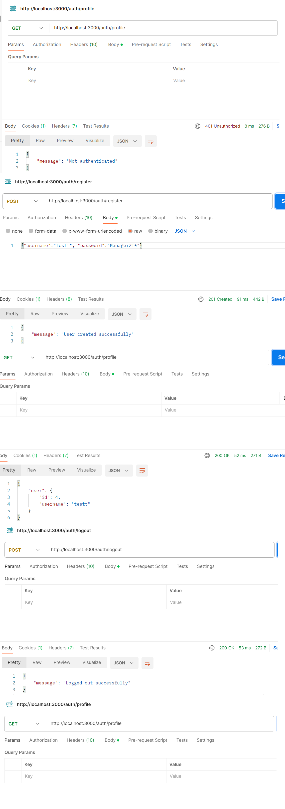

# pern-auth-session

add .env.development (copy it to a .env file and change it as necessary)
```
DB_HOST=localhost
DB_USER=pernauth
DB_PASSWORD=pernauthpwd
DB_NAME=pernauthdb
DB_DIALECT=postgres
DB_PORT=5433
DB_POOL_MAX=5
DB_POOL_MIN=0
DB_POOL_ACQUIRE=30000
DB_POOL_IDLE=10000
AUTH_SECRET=pern-auth-secret-key
```
install necessary software

```bash
npm install express-session sequelize pg pg-hstore connect-session-sequelize bcryptjs dotenv
```

add config/database.js

```js
const { Sequelize } = require('sequelize');

const sequelize = new Sequelize(process.env.DB_NAME, process.env.DB_USER, process.env.DB_PASSWORD, {
  host: process.env.DB_HOST,
  dialect: process.env.DB_DIALECT
});

module.exports = sequelize;
```

add File: config/session.js

```js
const session = require('express-session');
const SequelizeStore = require('connect-session-sequelize')(session.Store);
const sequelize = require('./database');

const sessionConfig = {
  secret: process.env.AUTH_SECRET,
  store: new SequelizeStore({
    db: sequelize,
  }),
  resave: false,
  saveUninitialized: false,
  cookie: {
    secure: process.env.NODE_ENV === 'production',
    maxAge: 24 * 60 * 60 * 1000 // 24 hours
  }
};

module.exports = sessionConfig;
```

add models/user

```js
const { DataTypes } = require('sequelize');
const sequelize = require('../config/database');

const User = sequelize.define('User', {
  username: {
    type: DataTypes.STRING,
    unique: true,
    allowNull: false
  },
  password: {
    type: DataTypes.STRING,
    allowNull: false
  }
});

module.exports = User;
```

add File: middlewares/auth.js

```js
const isAuthenticated = (req, res, next) => {
    if (req.session.userId) {
      next();
    } else {
      res.status(401).json({ message: 'Not authenticated' });
    }
  };
  
  module.exports = {
    isAuthenticated
  };
```

add File controllers/authController.js

```js
const bcrypt = require('bcryptjs');
const User = require('../models/user');

const authController = {
  register: async (req, res) => {
    try {
      const { username, password } = req.body;
      const hashedPassword = await bcrypt.hash(password, 10);
      
      const user = await User.create({
        username,
        password: hashedPassword
      });

      req.session.userId = user.id;
      res.status(201).json({ message: 'User created successfully' });
    } catch (error) {
      if (error.name === 'SequelizeUniqueConstraintError') {
        res.status(400).json({ message: 'Username already exists' });
      } else {
        res.status(500).json({ message: error.message });
      }
    }
  },

  login: async (req, res) => {
    try {
      const { username, password } = req.body;
      const user = await User.findOne({ where: { username } });
      
      if (!user) {
        return res.status(400).json({ message: 'User not found' });
      }

      const validPassword = await bcrypt.compare(password, user.password);
      if (!validPassword) {
        return res.status(400).json({ message: 'Invalid password' });
      }

      req.session.userId = user.id;
      res.json({ message: 'Logged in successfully' });
    } catch (error) {
      res.status(500).json({ message: error.message });
    }
  },

  logout: (req, res) => {
    req.session.destroy((err) => {
      if (err) {
        return res.status(500).json({ message: 'Could not log out' });
      }
      res.json({ message: 'Logged out successfully' });
    });
  },

  getProfile: async (req, res) => {
    try {
      const user = await User.findByPk(req.session.userId, {
        attributes: ['id', 'username']
      });
      res.json({ user });
    } catch (error) {
      res.status(500).json({ message: error.message });
    }
  }
};

module.exports = authController;
```

add File routes/auth.js

```js
const express = require('express');
const router = express.Router();
const authController = require('../controllers/authController');
const { isAuthenticated } = require('../middlewares/auth');

router.post('/register', authController.register);
router.post('/login', authController.login);
router.post('/logout', authController.logout);
router.get('/profile', isAuthenticated, authController.getProfile);

module.exports = router;
```

add the next code to File app.js

```js
/**
 * Main application file
 * Configures and initializes Express application with all middleware and routes
 */

// -------------------------------
// Environment & Module Imports
// -------------------------------
require('dotenv').config();
const createError = require('http-errors');
const express = require('express');
const path = require('path');
const cookieParser = require('cookie-parser');
const logger = require('morgan');
const session = require('express-session');

// -------------------------------
// Configuration Imports
// -------------------------------
const sessionConfig = require('./config/session');
const sequelize = require('./config/database');

// -------------------------------
// Route Imports
// -------------------------------
const indexRouter = require('./routes/index');
const usersRouter = require('./routes/users');
const authRouter = require('./routes/auth');

// -------------------------------
// Express Instance
// -------------------------------
const app = express();

// -------------------------------
// Database Initialization
// -------------------------------
sequelize.sync()
  .then(() => {
    console.log('✅ Database synchronized successfully');
  })
  .catch(err => {
    console.error('❌ Database synchronization error:', err);
    process.exit(1); // Exit if database connection fails
  });

// -------------------------------
// View Engine Configuration
// -------------------------------
app.set('views', path.join(__dirname, 'views'));
app.set('view engine', 'jade');

// -------------------------------
// Global Middleware Setup
// -------------------------------
// Request logging
app.use(logger('dev'));

// Request parsing
app.use(express.json());
app.use(express.urlencoded({ extended: false }));
app.use(cookieParser());

// Static file serving
app.use(express.static(path.join(__dirname, 'public')));

// Session handling
app.use(session(sessionConfig));

// -------------------------------
// Route Registration
// -------------------------------
app.use('/', indexRouter);
app.use('/users', usersRouter);
app.use('/auth', authRouter);

// -------------------------------
// Error Handling
// -------------------------------
// 404 Handler
app.use((req, res, next) => {
  next(createError(404));
});

// Global Error Handler
app.use((err, req, res, next) => {
  // Set locals for error page
  res.locals.message = err.message;
  res.locals.error = req.app.get('env') === 'development' ? err : {};
  
  // Log errors in development
  if (req.app.get('env') === 'development') {
    console.error('❌ Error:', err);
  }

  // Send error response
  res.status(err.status || 500);
  res.render('error');
});

// -------------------------------
// Export Application
// -------------------------------
module.exports = app;
```

run the command

```bash
npm start
```

Test with postman

